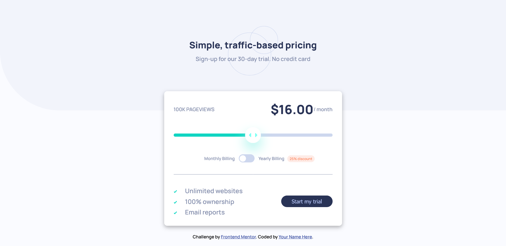

# Frontend Mentor - Interactive pricing component

## Welcome! 👋

Thanks for checking out this front-end coding challenge.

[Frontend Mentor](https://www.frontendmentor.io) challenges help you improve your coding skills by building realistic projects.

**To do this challenge, you need a basic understanding of HTML, CSS and JavaScript.**

## The challenge
Users should be able to:

- View the optimal layout for the app depending on their device's screen size
- See hover states for all interactive elements on the page
- Use the slider and toggle to see prices for different page view numbers

## My process

### Built with

- Semantic HTML5 markup
- CSS custom properties
- Flexbox
- Sass Partials, mixins and nesting
- [Styled Components](https://sass-lang.com/) - For styles

### What I learned

I used an IIFE (Immediately Invoked Function Expression) in my JavaScript which is a function that runs as soon as it is defined. Yet to fully learn its power but it worked well to what i wanted. Special shout to [Cheosphere](https://www.frontendmentor.io/profile/Cheosphere) source code, i got to know of its use. Check out his projects, they are amazing👌🏽👌🏽.

Very interesting frontend mentor project i must say.

####

- Frontend Mentor - [CSS-Viki](https://www.frontendmentor.io/profile/CSS-Viki)
- Live Site URL: - [Live site](https://interactive-pricing-component-project.onrender.com)

Coded with ❤️ by [Viki Wainaina](https://twitter.com/vykiddeh_)

**Have fun building!** 🚀
